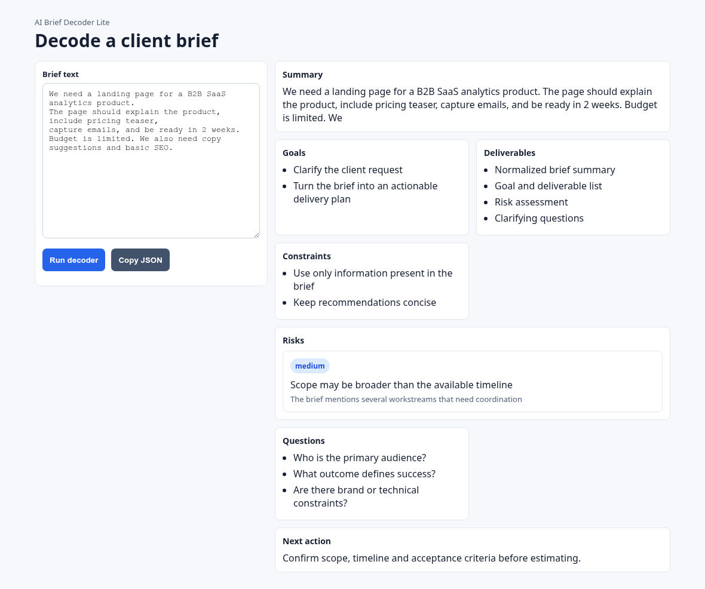
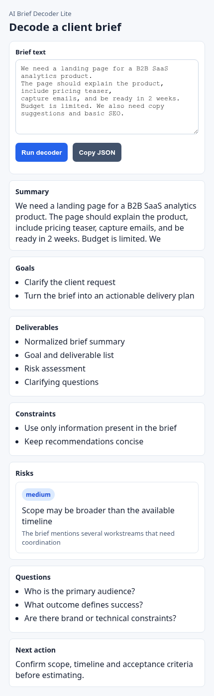

# AI Brief Decoder Lite

Прототип для тестового задания Senior Fullstack Engineer. Расширение Chrome принимает текст клиентского брифа, отправляет его в FastAPI, сервер получает структурированный ответ от LLM-провайдера, проверяет его Pydantic-схемой, сохраняет run в PostgreSQL и возвращает результат в интерфейс расширения.

Проект запускается локально без платного API-ключа: по умолчанию используется fake provider.

## Демо

Рабочий сценарий: текст брифа -> запуск decode -> структурированный результат.



Вертикальный вид соответствует формату popup в Chrome:

<p align="center">
  
</p>

## Состав

- `backend` — FastAPI, SQLAlchemy, Pydantic, PostgreSQL.
- `extension` — Chrome Extension Manifest V3 на React и TypeScript.
- `AI_USAGE.md` — как использовался AI-агент во время разработки.

## Быстрый запуск

PostgreSQL:

```bash
docker compose up -d postgres
```

Backend:

```bash
cd backend
python3 -m venv .venv
. .venv/bin/activate
pip install -r requirements.txt
cp .env.example .env
uvicorn app.main:app --reload
```

Проверка:

```bash
curl http://localhost:8000/health
```

Extension:

```bash
cd extension
npm install
npm run typecheck
npm run build
```

Собранное расширение находится в `extension/dist`. Его можно загрузить в Chrome через `chrome://extensions` -> Developer mode -> Load unpacked.

По умолчанию popup обращается к `http://localhost:8000`. Для другого адреса:

```bash
VITE_API_URL=http://127.0.0.1:8020 npm run build
```

## API

### `POST /v1/briefs/decode`

```json
{
  "text": "We need a landing page for a B2B SaaS analytics product...",
  "mode": "normal"
}
```

`mode` нужен для локальной проверки fake provider:

- `normal`
- `malformed_json`
- `missing_fields`
- `bad_severity`
- `provider_failure`

### `GET /v1/briefs/runs/{run_id}`

Возвращает сохраненный run: исходный текст, статус, структурированный результат, raw provider output, безопасную ошибку и timestamps.

## Fake provider и real provider

По умолчанию используется fake provider:

```env
LLM_PROVIDER=fake
```

Он не требует ключей и умеет возвращать как валидный структурированный ответ, так и ошибки для проверки failure paths.

Заготовка для real provider есть в `backend/app/providers.py`. Для продакшн-версии я бы подключил OpenAI Responses API со строгой JSON-схемой, retries, timeout, request id и логированием без пользовательского текста.

## Тесты

```bash
cd backend
. .venv/bin/activate
pytest
```

Проверяются:

- Pydantic validation для валидного результата;
- отсутствие обязательных полей;
- неверное значение `severity`;
- happy-path API с fake provider;
- ошибки provider и malformed JSON.

Frontend/extension:

```bash
cd extension
npm run typecheck
npm run build
```

## Что осталось бы сделать дальше

- Подключить real LLM provider со strict structured output.
- Добавить Alembic вместо `create_all`.
- Добавить request tracing и structured logs.
- Покрыть extension e2e smoke-тестом.
- Добавить background/service worker для очередей и retry, если сценарии станут длиннее.
- При необходимости перейти на WXT. В этом прототипе выбран обычный Manifest V3 + Vite, потому что он проще воспроизводится локально и не тянет лишний dev tooling.
